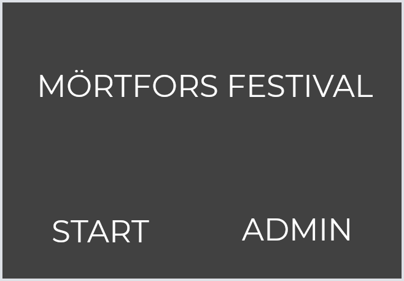
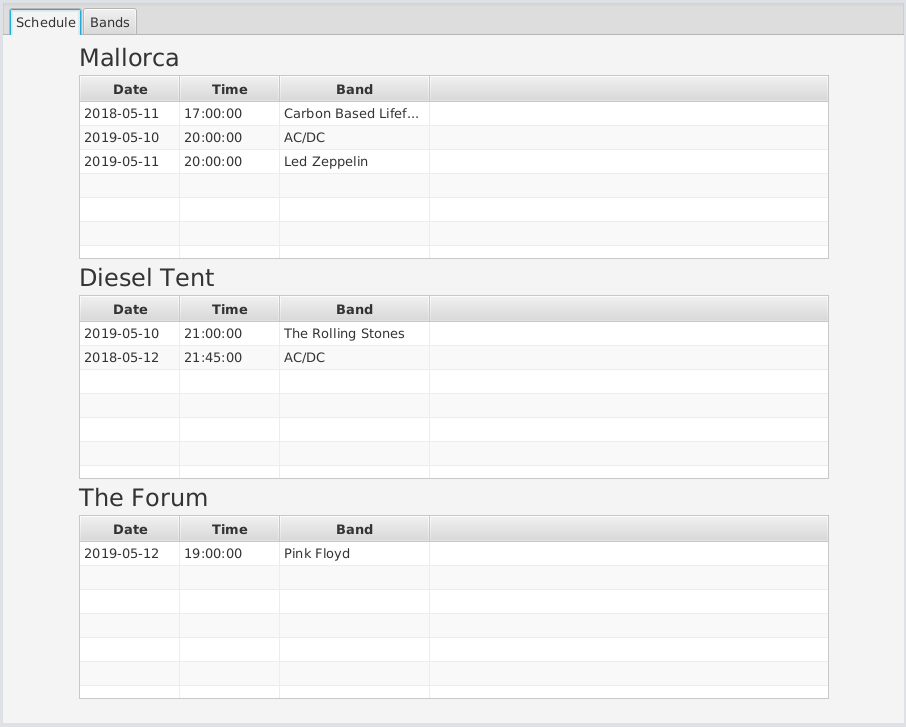
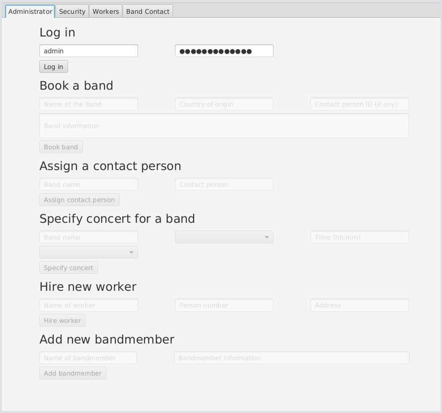
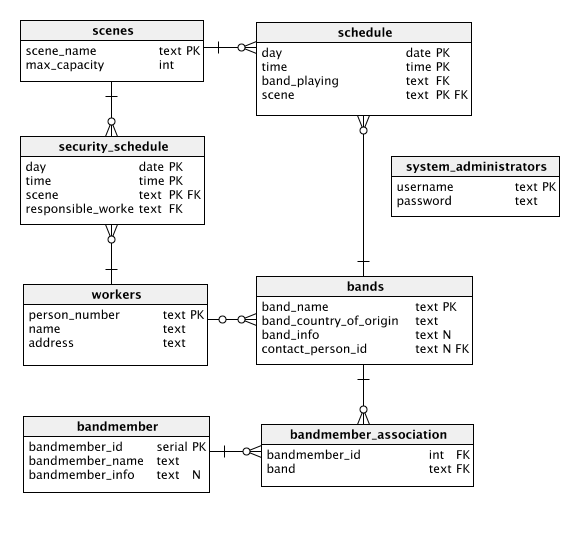

# Festivalbase
Festivalbase is a program for handling a fictional festivals schedule. It is written using PostgreSQL and Java. 
The main goal of the project was to learn SQL. 

## Description of program use:
   The user is initially presented with a 'Start' Screen.
    If the user clicks on 'Start', the schedule view will be presented where
    the user can see the festival schedule and all the bands attending the festival.
    If the user clicks on 'Admin', the user is taken to the administrator view.
    
   

   In both views the user can select a tab on the top of the window to change between the internal views.
   The normal user can switch between the following tabs:
   * **Schedule:**
        Contains the schedule for the festivals different scenes.
        
   * **Bands:**
        A list of all the bands performing at the festival.
        
   Example:
   
   

   Administrators will see the following tabs:
   * **Administrator:**
        Contains administrator features such as booking a band,
        assigning a contact person to a band,
        specifying a concert for a band
        and hiring a new worker.

   * **Security:**
        Contains the security schedule for the festival.
        Shows what worker is responsible for security at 
        different scenes and times.

   * **Workers:**
        Contains a list of all the workers at the festival.

   * **Band Contact:**
        Contains a list of how many band members each worker is
        a contact person for.
        
   Example:
   
   

## Components of the program:
   The program is built using the MVC designpattern, with 'controllers'
   handling logic, 'views' handling graphical components and 'models' 
   as objects containing data.
  
  ### SQLFiles:
   The SQL file used to create the database.

 ### Controllers:
   
**Main:**
            Used to start the program. Initializes the first views.
        
**MainViewController:**
            Controller for the main 'view' of the program.
            This is the view that is presented to normal users
            wishing to see the festival schedule.
            Handles logic for the main UI.

**SQLController:**
            Handles database queries.
            This is a static class that is called by the other controllers
            when they need to insert or retrieve data from the database.

**StartViewController:**
            Controller for the 'start' view. Starts the normal schedule program if
            the user presses 'Start', and starts the administrator program if
            the user presses 'Admin'.

### Models:
   
**Band:**
            Represents a band in the database.

**ResponsibilityTable:**
            Represents a table containing the connections between workers
            and bands / bandmembers.

**SecuritySchedule:**
            Represents the schedule containing the security schedule
            for the festival.

**StageSchedule:**
            Represents the schedule for the concerts at a specific stage.

**Worker:**
            Represents a worker at the festival.

### Resources:
   Contains images used in the UI.

### Views:
   Contains the FXML files for JavaFX.
        These files contain information about the position and function
        of the graphical interface and its elements.

### Database ER-Diagram:
  

